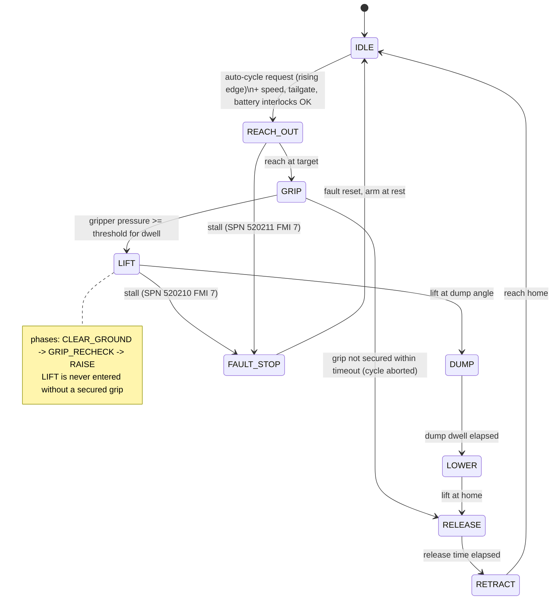

# Architecture

## Controller

`controller_step(const inputs_t *in, outputs_t *out, state_t *s)` runs every 10 ms
(`CONTROLLER_STEP_MS`). It is pure C99 with static storage only; the variant's tunables arrive
through `s->p` (a `const params_t *`, generated from `variants/*.yaml`).

Per step:

1. `update_sensors()` - range-check and scale the raw lift/reach sensor voltages, low-pass filter,
   raise sensor DTCs (debounced).
2. Interlocks (`firmware/src/interlocks.c`): `interlock_vehicle_speed()`, `interlock_tailgate()`,
   `interlock_battery_temp()`, `interlock_grip_secured()`.
3. Mode: jog (operator joystick) or auto-cycle state machine (`step_cycle()`, `step_lift()`).
4. Motion shaping: `motion_approach_velocity()` decelerates into targets,
   `interlock_soft_limit_lift()/_reach()` decelerate into the soft limits, `rate_limit()` applies the
   acceleration limit.
5. Stall monitoring (`stall_monitor_update()`), DTC table update (`faults.c`), outputs.

CAN encode/decode is separate (`can_io.c`) so the same controller runs in the SIL library
(`firmware/sil/sil_api.c`) and on the target (`firmware/target/main.c`).

## Auto-cycle state machine



Speed, tailgate and battery interlocks gate all motion: while one is not satisfied the motion
commands are forced to zero. Sensor and stall faults go straight to `FAULT_STOP`.
In `FAULT_STOP` all motion outputs are zero.

## Module map

| Module | Responsibility |
|---|---|
| `controller.c` | State machine, jog mode, motion shaping, fault entry |
| `interlocks.c` | One function per interlock, soft limits, stall monitor |
| `scaling.c` | Sensor mV → engineering units, open/short detection |
| `filters.c` | First-order LPF, rate limiter, debounce |
| `faults.c` | Fixed-size active DTC table (DM1 source) |
| `can_io.c` | J1939 RX decode into `inputs_t`, TX scheduling/encoding of `outputs_t` |
| `sil/sil_api.c` | Shared-library API for the SIL harness |
| `target/main.c` | 10 ms loop on the ECU, HAL hooks |

## SIL harness

```
 SimPlant ──frames──▶ python-can virtual bus ◀──frames── SilEcu (ctypes → libasl200_sil_<variant>.so)
                           │
                           └── logger endpoint → trace.json / candump
```

The plant and the ECU only exchange encoded CAN frames (encoded/decoded with `cantools` against
`can/asl200.dbc`), so a field log can be replayed by putting its frames on the bus.
`SimPlant` models both axes with first-order actuator response, acceleration limits and
temperature effects (hydraulic oil viscosity; electric battery-temperature derating), and sensors
with noise, latency and dropout. Every run is deterministic for a given seed.

`HilRigPlant` has the same `PlantInterface`; it is the attachment point for a bench rig and is a stub.
